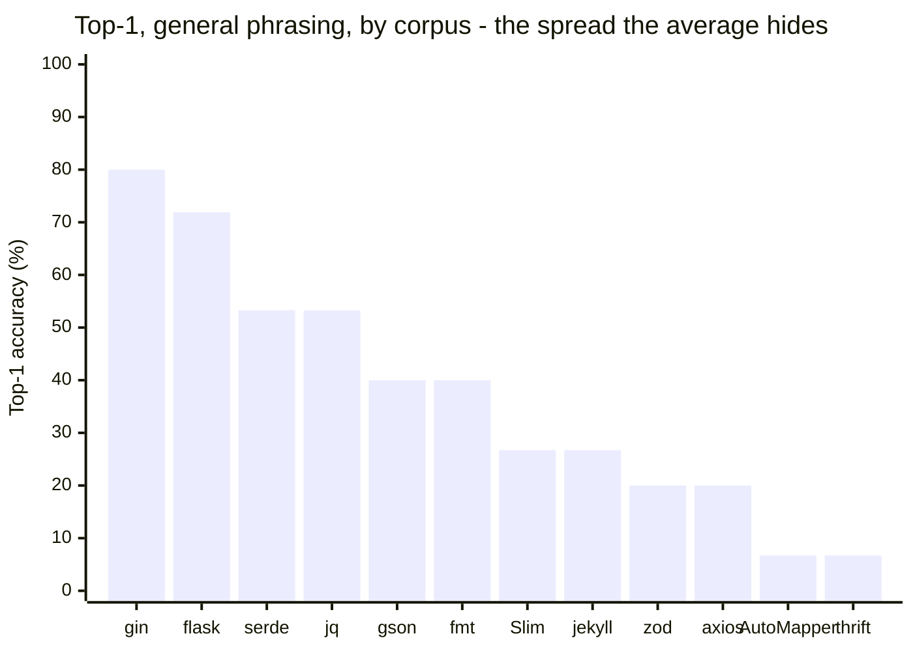
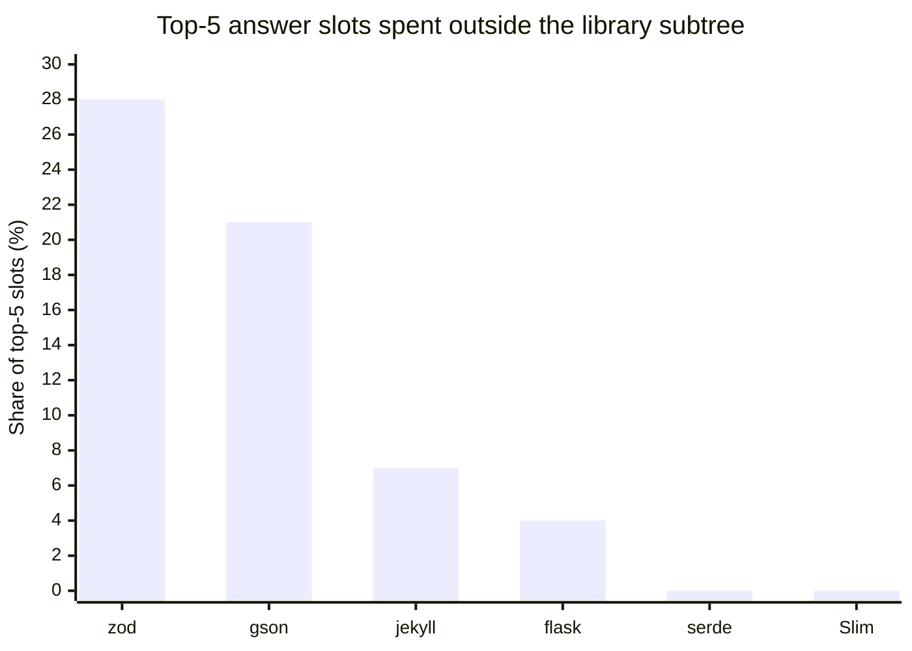
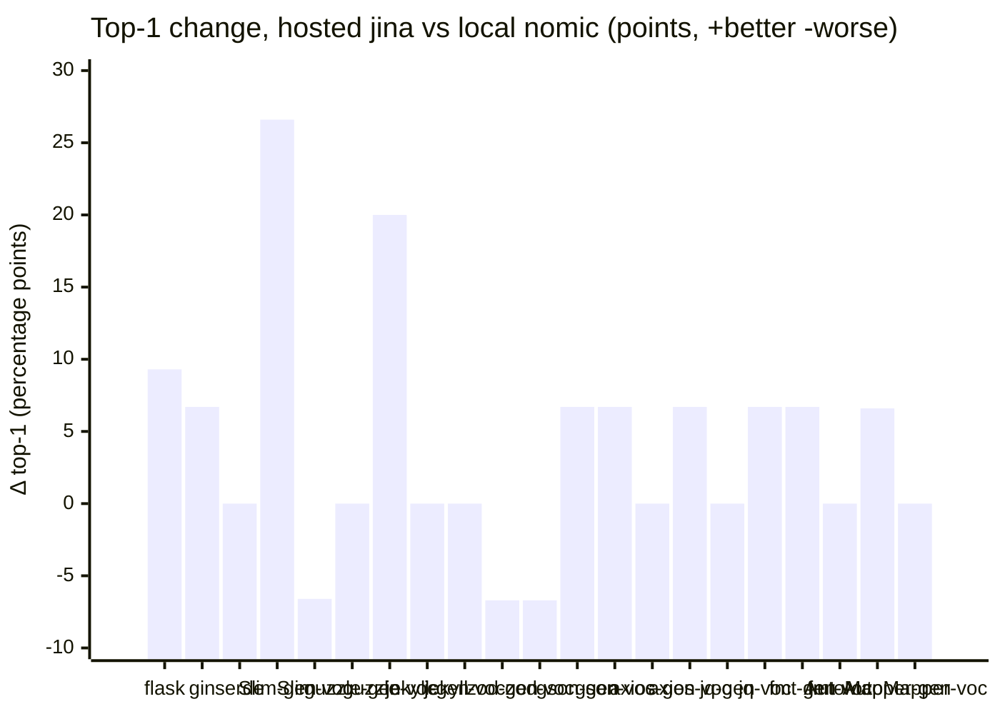
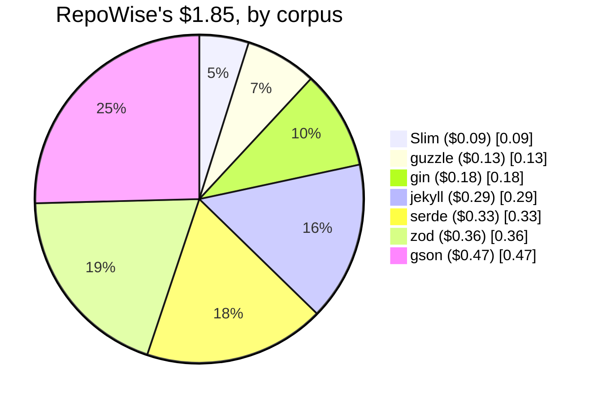

<div align="center">

# Aletheore Benchmarks

<p>
  
  
  
  
  
</p>

### Reproducible evaluation of Aletheore's code retrieval and generated documentation, measured head-to-head against RepoWise.

<sub>Every number here can be recomputed from the raw results in <code>results/</code> with no API key and no network.<br/>The harness, the questions, the ground truth and the losses are all in this repository.</sub>

<p><sub>
  <a href="#locating-code--which-file-implements-x">Locating code</a> ·
  <a href="#hosted-embeddings-jina-vs-local-nomic">Hosted vs local</a> ·
  <a href="#head-to-head-against-repowise">Head-to-head</a> ·
  <a href="#cost-to-get-to-a-searchable-index">Cost</a> ·
  <a href="#covering-the-files-a-pr-touches">PR coverage</a> ·
  <a href="#explaining-code--how-does-x-work">Explaining code</a> ·
  <a href="#where-we-lose">Where we lose</a> ·
  <a href="#reproducing">Reproducing</a> ·
  <a href="#contents">Contents</a>
</sub></p>

---

<table align="center">
<tr>
<td align="center" width="240"><h2>5–0–2</h2></td>
<td align="center" width="240"><h2>$0.00</h2></td>
<td align="center" width="240"><h2>93.3%</h2></td>
</tr>
<tr>
<td align="center" valign="top"><sub><strong>head-to-head vs RepoWise.</strong><br />5 wins, 0 losses, 2 ties on top-1<br />locating code, all 7 shared corpora.</sub></td>
<td align="center" valign="top"><sub><strong>to build a searchable index,</strong><br />all 7 corpora — local <code>nomic-embed-text</code>,<br />vs RepoWise's $1.85 for the same set.</sub></td>
<td align="center" valign="top"><sub><strong>cross-language top-5,</strong><br />up from 60.0% after fixing a language<br />pre-filter that was silently unused.</sub></td>
</tr>
</table>

<sub>Measured on <strong>Aletheore 0.8.11</strong>, installed from PyPI, against RepoWise's own generated wiki.<br/><strong>We publish the rows we lose</strong> — see <a href="#where-we-lose">Where we lose</a>.</sub>

</div>

---

## Locating code — "which file implements X?"

Aletheore indexes code chunks and returns `file:line`.

Measured in one run with **Aletheore 0.8.11 installed from PyPI**, each corpus
re-scanned and re-indexed from scratch with local `nomic-embed-text` (768-dim)
embeddings, no API key:

| corpus | regime | top-1 | top-3 | top-5 | MRR | n |
|---|---|---:|---:|---:|---:|---:|
| location (Flask) | general | 71.9% | 93.8% | 100.0% | 0.832 | 32 |
| gin | general | 80.0% | 100.0% | 100.0% | 0.878 | 15 |
| serde | general | 53.3% | 66.7% | 73.3% | 0.617 | 15 |
| Slim | general | 26.7% | 60.0% | 66.7% | 0.458 | 15 |
| Slim | vocabulary | 73.3% | 80.0% | 93.3% | 0.797 | 15 |
| guzzle | general | 20.0% | 53.3% | 66.7% | 0.374 | 15 |
| guzzle | vocabulary | 53.3% | 93.3% | 100.0% | 0.728 | 15 |
| jekyll | general | 26.7% | 33.3% | 46.7% | 0.337 | 15 |
| jekyll | vocabulary | 66.7% | 86.7% | 93.3% | 0.778 | 15 |
| zod | general | 20.0% | 40.0% | 40.0% | 0.289 | 15 |
| zod | vocabulary | 60.0% | 73.3% | 73.3% | 0.667 | 15 |
| gson | general | 40.0% | 66.7% | 80.0% | 0.544 | 15 |
| gson | vocabulary | 60.0% | 86.7% | 86.7% | 0.749 | 15 |
| axios | general | 20.0% | 46.7% | 66.7% | 0.407 | 15 |
| axios | vocabulary | 73.3% | 93.3% | 100.0% | 0.850 | 15 |
| jq | general | 53.3% | 66.7% | 80.0% | 0.648 | 15 |
| jq | vocabulary | 73.3% | 100.0% | 100.0% | 0.867 | 15 |
| fmt | general | 40.0% | 60.0% | 86.7% | 0.527 | 15 |
| fmt | vocabulary | 66.7% | 93.3% | 93.3% | 0.789 | 15 |
| AutoMapper | general | 6.7% | 20.0% | 33.3% | 0.177 | 15 |
| AutoMapper | vocabulary | 86.7% | 100.0% | 100.0% | 0.933 | 15 |
| thrift | general | 6.7% | 33.3% | 53.3% | 0.241 | 15 |
| thrift | cross-language | 53.3% | 73.3% | 93.3% | 0.677 | 15 |

The audit file has no 0.8.11 result line for `thrift_anylang`, so this table
does not invent one; its two published Thrift rows are reproduced exactly.

All **11 supported languages** are now measured, across 12 single-language
corpora plus Thrift's published regimes — including
`apache/thrift`, the first genuinely polyglot corpus (eight languages, none
above a third of the modules), which implements the same protocol separately in
each language and so tests whether retrieval can tell one language's
implementation from another's. Two
question regimes are published for every corpus written since the confound was
found: *general* phrasing deliberately avoids the project's own vocabulary,
*vocabulary* phrasing uses it. Real users ask somewhere between the two, so a
language's true figure is bracketed by them rather than given by either.

```mermaid
xychart-beta
    title "The phrasing confound: top-1 for the same questions, project vocabulary vs avoiding it"
    x-axis [Slim, zod, jekyll, guzzle, gson]
    y-axis "Top-1 accuracy (%)" 0 --> 100
    bar "vocabulary-avoiding" [26.7, 20.0, 26.7, 20.0, 40.0]
    bar "project vocabulary" [73.3, 60.0, 66.7, 53.3, 60.0]
```



**Every weak corpus moves 20-47 points on wording alone** — larger than every
ranking change in this programme combined. It means the retrieval table above
measures a phrasing regime at least as much as it measures the product. Both
regimes are kept and published for every corpus; a language's true figure is
bracketed by the two rather than given by either.

Raw per-query output is in `results/`, one file per corpus, regime and system.
The ten pre-existing corpus rows are unchanged by 0.8.7-0.8.11 work outside
their targets; the two changed rows are Gson top-3 (73.3% → 66.7%) and
AutoMapper top-3 (13.3% → 20.0%), both from #236.

**The spread is the finding.** Go and Python are strong; Java, Ruby, PHP and
TypeScript are not, and the weak corpora were measured last, so the published
average would have looked considerably better had we stopped at three languages.



Of the causes investigated below, one is fixed, one is measured but only partly
recoverable, one was tested and ruled out, and one turned out to be **our own
question authoring rather than the product**. Two candidate ranking changes were
implemented in full and rejected on measurement.

<details>
<summary><strong>Asking in one language and being answered in another</strong> — the one defect that survives good phrasing</summary>

`apache/thrift` implements the same protocol separately in eight languages, so a
question naming one has a single correct answer and seven near-identical wrong
ones. A third regime, `thrift_crosslang.json`, tests exactly that: full project
vocabulary plus an explicit language, so the only difficulty is picking the
right language's file.

Measured on 0.8.10, five of six failures returned a **different language's file
entirely** — C++ missed all three of its questions, returning Python and .NET
implementations instead. The cause was not ranking: `search_index` already
accepted a `language` pre-filter, and nothing ever populated it, so the language
named in the question competed only as ordinary text.

| regime | metric | 0.8.10 | 0.8.11 |
|---|---|---|---|
| cross-language | top-3 | 60.0% | **73.3%** |
| cross-language | top-5 | 60.0% | **93.3%** |
| cross-language | MRR | 0.576 | **0.677** |
| general | top-5 | 40.0% | **53.3%** |

This is the one defect found here that the phrasing confound does **not**
explain: the cross-language questions already use full vocabulary, so the
failure survives good questions. The fix raises cross-language top-5 from
60.0% to **93.3%**. It is also invisible to every single-language
corpus, which is what the polyglot corpus was added to find.

Detection only fires when a query names a language, and across all 356
single-language questions in this repository it fires on two, both in flask
naming Python, whose results are unchanged to three decimals of MRR.

</details>

<details>
<summary><strong>Why the weak corpora are weak</strong> — near-duplicate crowding, sibling-module pollution, and the phrasing test that explained most of it</summary>

**Near-duplicate crowding is recorded as a phrasing symptom, not a live ranking
lead.** The apparent sibling pollution in Slim, Gson and Thrift was checked
against the vocabulary regimes: the misses disappear when the question names
the project's own symbols. Two ranking fixes were built and rejected on
measurement. The finding and its falsification are recorded in
`METHODOLOGY.md`; no further ranking work should treat crowding as the leading
explanation without new evidence.

**Not the cause: inheritance.** It was proposed that a base class is being
crowded out by its children, and that promoting base classes would fix it.
`RequestResponse`, `RequestResponseArgs` and `RequestResponseNamedArgs` are
*siblings* — each implements `InvocationStrategyInterface` — so there is no
inheritance edge to exploit.

**Sibling-module pollution (TypeScript, Java).** In a repository holding more
than one module, results are drawn from modules that are not the library:

| corpus | top-5 slots spent outside the library subtree |
|---|---|
| zod | 21/75 (**28%**) — `packages/docs`, `packages/bench`, `packages/resolution` |
| gson | 16/75 (**21%**) — `proto/`, `metrics/`, `extras/` |
| jekyll | 5/75 (7%) |
| flask | 7/160 (4%) |
| serde, Slim | 0% |



Roughly a quarter of zod's answer budget goes to documentation and benchmark
code. Nothing in the index distinguishes "the library" from "everything else
that happens to live in the repository".

**How much of that is recoverable was then measured, and the answer differs by
repository.** Hard-filtering results to the library subtree lifts gson top-1
33.3% → 40.0% and top-5 66.7% → 80.0%, but recovers **nothing** for zod: its
correct answers are not ranked 6-10 either, so the pollution is a symptom there
rather than the cause. An earlier revision of this file claimed the pollution
explained zod's score. It does not, and that claim was wrong.

**Not the cause: file size.** The obvious explanation — that big central files
lose to small peripheral ones — was tested across all corpora and is
false. The top-1 result is *larger* than the ground-truth file in 80–94% of
flask and gin questions. There is no systematic size bias in either direction.

**The weak scores are mostly our own question authoring.** This was tested on
jekyll first and then on every other weak corpus, by rewriting *all fifteen*
questions in each set - not only the missed ones - using the project's own
vocabulary, against identical code and identical ground truth:

| corpus | vocabulary-avoiding | project vocabulary | Δ top-1 |
|---|---|---|---|
| Slim (PHP) | 26.7% | **73.3%** | +46.6 |
| zod (TypeScript) | 20.0% | **60.0%** | +40.0 |
| jekyll (Ruby) | 26.7% | **66.7%** | +40.0 |
| guzzle (PHP) | 20.0% | **53.3%** | +33.3 |
| gson (Java) | 40.0% | **60.0%** | +20.0 |

It also retires a conclusion this file previously drew. PHP was initially
described as a ranking problem - near-duplicate crowding - and two fixes were
built and rejected against it. Slim moves 26.7% → 73.3% on phrasing, so most
of what those fixes were chasing was an artefact of how the questions were
written. The finding is recorded in `METHODOLOGY.md` as a phrasing symptom,
not a live ranking lead.

Rewriting only the missed questions was considered and rejected - correcting
just the failures can move a score in one direction only.

**These numbers replace an earlier table that did not reproduce.** The previous
revision listed flask at 71.9% / 96.9% / 100%, which matched no committed
results file — it blended top-1 from one run with top-3 and top-5 from another.
Re-running the published harness against every 0.8.x release produced the
earlier 65.6% / 93.8% / 100% and 68.8% / 93.8% / 100% figures for 0.8.5. The
current table is the single 0.8.11 PyPI run from `/private/tmp/audit-0811.txt`;
the lesson is recorded in **METHODOLOGY.md** rather than quietly corrected.

</details>

## Hosted embeddings: jina vs local nomic

> **This section does not carry the same "no API key, no network" guarantee
> as the rest of this repository.** It measures Aletheore's *hosted*
> embedding endpoint (`jina-embeddings-v2-base-code`, Q8_0 GGUF via
> llama.cpp), which requires `aletheore login` and a paid plan. It was run
> against a dev checkout at commit
> [`e2cc409`](https://github.com/Aletheore/Aletheore/commit/e2cc409),
> not a PyPI release — everything else in this repository is 0.8.11 from
> PyPI; this section is the one exception, and is labeled as one rather than
> folded into the reproducible table above.

Same 12 corpora, same 21 corpus/regime pairs, same questions and ground
truth as the table above - only the embedder changed, local `nomic-embed-text`
(768-dim) to hosted `jina-embeddings-v2-base-code` (768-dim).



**Mean: top-1 +3.9pp, MRR +0.045. 18 of 21 rows flat or better; 3 worse, all
in either Slim's vocabulary regime or zod.**

| corpus | nomic top-1 | jina top-1 | Δ top-1 | nomic MRR | jina MRR | |
|---|---:|---:|---:|---:|---:|:-:|
| flask (location) | 71.9% | 81.2% | +9.3pp | 0.832 | 0.901 | ✅ |
| gin | 80.0% | 86.7% | +6.7pp | 0.878 | 0.933 | ✅ |
| serde | 53.3% | 53.3% | +0.0pp | 0.617 | 0.678 | 🟰 |
| Slim (general) | 26.7% | 53.3% | +26.6pp | 0.458 | 0.647 | ✅ |
| Slim (vocab) | 73.3% | 66.7% | -6.6pp | 0.797 | 0.811 | ⚠️ |
| guzzle (general) | 20.0% | 20.0% | +0.0pp | 0.374 | 0.458 | 🟰 |
| guzzle (vocab) | 53.3% | 73.3% | +20.0pp | 0.728 | 0.844 | ✅ |
| jekyll (general) | 26.7% | 26.7% | +0.0pp | 0.337 | 0.382 | 🟰 |
| jekyll (vocab) | 66.7% | 66.7% | +0.0pp | 0.778 | 0.791 | 🟰 |
| zod (general) | 20.0% | 13.3% | -6.7pp | 0.289 | 0.237 | ⚠️ |
| zod (vocab) | 60.0% | 53.3% | -6.7pp | 0.667 | 0.658 | ⚠️ |
| gson (general) | 40.0% | 46.7% | +6.7pp | 0.544 | 0.569 | ✅ |
| gson (vocab) | 60.0% | 66.7% | +6.7pp | 0.749 | 0.797 | ✅ |
| axios (general) | 20.0% | 20.0% | +0.0pp | 0.407 | 0.420 | 🟰 |
| axios (vocab) | 73.3% | 80.0% | +6.7pp | 0.850 | 0.878 | ✅ |
| jq (general) | 53.3% | 53.3% | +0.0pp | 0.648 | 0.728 | 🟰 |
| jq (vocab) | 73.3% | 80.0% | +6.7pp | 0.867 | 0.883 | ✅ |
| fmt (general) | 40.0% | 46.7% | +6.7pp | 0.527 | 0.621 | ✅ |
| fmt (vocab) | 66.7% | 66.7% | +0.0pp | 0.789 | 0.789 | 🟰 |
| AutoMapper (general) | 6.7% | 13.3% | +6.6pp | 0.177 | 0.243 | ✅ |
| AutoMapper (vocab) | 86.7% | 86.7% | +0.0pp | 0.933 | 0.922 | 🟰 |

<details>
<summary><strong>Why zod regresses</strong> — checked directly rather than left as a footnote</summary>

Both zod rows are among the three cells that move against jina. Two candidate
explanations were checked and one holds.

**Not a scanner or language-specific bug.** zod's index build logged no
warnings, its chunk count (2,395) is unremarkable, and a comparison against a
saved older nomic run, question by question, on the general-regime questions,
shows the exact same **6/15 top-5 hit rate** for both embedders - they
disagree on which two questions they answer, but not on how many.

**The real cause, checked at the individual question level:** zod ships
parallel `classic` and `mini` API variants that implement near-duplicate ISO
date/time types for different bundle targets. For "Where are date and time
string formats defined as their own types?" (ground truth
`packages/zod/src/v4/classic/iso.ts`), jina ranked `mini/iso.ts` 5th and the
correct `classic/iso.ts` 7th - both files answer the question about equally
well in isolation, and only the corpus's own name for one of them is "the"
answer. This is the same **near-duplicate crowding** category already
documented above for Slim, Gson and Thrift, landing on zod's classic/mini
split instead this time. It is not new to jina, and on a 15-question sample a
2-question rank shift is within ordinary embedder-swap noise, not a
systematic defect.

</details>

Raw rows are in
[`results/retrieval_raw_jina_hosted.json`](results/retrieval_raw_jina_hosted.json),
produced by
[`scripts/run_retrieval_matrix.py`](scripts/run_retrieval_matrix.py) and
scored by
[`scripts/score_retrieval_matrix.py`](scripts/score_retrieval_matrix.py) -
no API key needed to re-derive the table from the saved rows, only to
reproduce the run that generated them.

## Head-to-head against RepoWise

Same questions, same ground truth, **all seven shared corpora**. RepoWise
searches its own generated wiki pages, so each corpus had a wiki built for it
first (`init --coverage 1.0`, deepseek-v4-flash, 1,341 pages, $1.85 total).
Best RepoWise mode per corpus is shown.

```mermaid
xychart-beta
    title "Locating code, top-1: Aletheore vs RepoWise (best mode)"
    x-axis [gin, serde, gson, jekyll, Slim, guzzle, zod]
    y-axis "Top-1 accuracy (%)" 0 --> 100
    bar "Aletheore" [80.0, 53.3, 40.0, 26.7, 26.7, 20.0, 20.0]
    bar "RepoWise" [60.0, 13.3, 26.7, 13.3, 26.7, 20.0, 13.3]
```



| corpus | language | Aletheore | RepoWise semantic | RepoWise fulltext | winner |
|---|---|---|---|---|---|
| gin | Go | **80.0%** | 60.0% | 46.7% | ✅ Aletheore |
| serde | Rust | **53.3%** | 6.7% | 13.3% | ✅ Aletheore |
| gson | Java | **40.0%** | 26.7% | 0.0% | ✅ Aletheore |
| jekyll | Ruby | **26.7%** | 13.3% | 6.7% | ✅ Aletheore |
| Slim | PHP | 26.7% | 26.7% | 20.0% | 🟰 tie |
| guzzle | PHP | 20.0% | 13.3% | 20.0% | 🟰 tie |
| zod | TypeScript | **20.0%** | 6.7% | 13.3% | ✅ Aletheore |

**Top-1: 5 wins, 0 losses, 2 ties.** Our weakest languages still match or beat
them. Where we lose: jekyll top-5, 46.7% against their 66.7%.

Both systems were then given the **vocabulary** questions as well, on the same
wikis (search costs nothing to re-run once a wiki exists):

| corpus | Aletheore general | RepoWise general | Aletheore vocabulary | RepoWise vocabulary |
|---|---|---|---|---|
| Slim | 26.7% | 26.7% | **73.3%** | 66.7% |
| gson | **40.0%** | 26.7% | **60.0%** | 46.7% |
| zod | **20.0%** | 13.3% | **60.0%** | 26.7% |
| guzzle | 20.0% | 20.0% | 53.3% | 53.3% |
| jekyll | **26.7%** | 13.3% | 66.7% | **80.0%** |

RepoWise gains from vocabulary phrasing too — its wiki pages name the symbols —
and on jekyll it overtakes us outright, 80.0% against 66.7%. That is a real
loss and it is stated here rather than omitted. Across the ten cells we lead in
seven, tie in two and lose one.

Flask remains as originally measured (Aletheore 68.8% / 93.8% / 100% against
RepoWise semantic 28.1% / 56.2% / 56.2%).

Two things this table deliberately does not claim:

- **`--mode symbol` returned 0.0% on every corpus and is excluded.** Feeding
  natural-language questions to a symbol-name search misuses the mode rather
  than measuring it. It is in the raw results; it is not counted as a loss for
  RepoWise.
- **These latencies are not comparable and no speed claim is made here.**
  RepoWise's search is invoked per query as a CLI process (2.4-4.5 s including
  interpreter startup); Aletheore's is measured in-process (~72 ms). The honest
  like-for-like figure, from the flask run, is RepoWise 68 ms against our
  125 ms in-process — *they are faster*.

## Cost to get to a searchable index

| | Aletheore | RepoWise |
|---|---|---|
| indexing cost, 7 corpora | **$0.00** | $1.85 |
| per corpus | **$0.00** | $0.09 - $0.47 |
| what it costs money for | nothing - local `nomic-embed-text` | LLM generation of 1,341 wiki pages |
| typical setup time | seconds to ~1 min per corpus | minutes per corpus |

Per corpus, RepoWise: Slim $0.09, guzzle $0.13, gin $0.18, jekyll $0.29,
serde $0.33, zod $0.36, gson $0.47. Aletheore's side needs no API key at all,
which is also why every number in this repository can be recomputed without
one.



## Covering the files a PR touches

Over the last 30 non-merge commits of Flask (100 changed files), how often does
AIRview have anything at all to say about a file that changed?

| | commits with every changed file covered | changed files covered |
|---|---:|---:|
| AIRview pages alone | 4 / 30 | 21 / 100 |
| pages + deterministic file fallback | **30 / 30** | **100 / 100** |

```mermaid
xychart-beta
    title "PR-touched-file coverage: pages alone vs pages + fallback"
    x-axis ["commits fully covered", "changed files covered"]
    y-axis "Coverage (%)" 0 --> 100
    bar "AIRview pages alone" [13.3, 21]
    bar "pages + deterministic fallback" [100, 100]
```



Only 15 of the 30 commits had a page for even one of their changed files.
Coverage — not ranking quality on the files already covered — was the real gap
against RepoWise's 100%.

The fallback closes it without a model call. It reads the scanner's existing
module record (symbols with line numbers, imports, importers) and, for files
outside the module set, a source excerpt capped at 5,000 characters, with
structured reduction for lockfiles and changelogs where a blind cutoff would
keep an arbitrary byte range. Cost per file: **$0.00** — no API key, no
generation, no addition to the paid AIRview writing pipeline.

<details>
<summary>No token-savings claim is made here, and an earlier draft's was withdrawn — why</summary>

That draft compared the fallback's output against reading each changed file in
full (96.5% fewer tokens) and against the commit diff (2.9x *more* tokens on
the median commit, more expensive on 22 of 30). Both comparisons were dropped
as meaningless rather than merely unflattering: `build_file_fallback_detail` is
called only from the dashboard's file browser, one file at a time on request,
and never from the pull-request review path — so it does not stand in for a
diff or for a full-file read. What it stands in for is a blank page. The
quality question that remains — is the block it returns actually useful — is
measured by the judge below, not by counting its tokens.

</details>

## Explaining code — "how does X work?"

Blind LLM judge, 0-3, each question graded twice with the two systems' positions
swapped, equal 12,000-character context budget, tool names scrubbed.

| | score | gap | tokens | cost |
|---|---|---|---|---|
| AIRview | 2.13 | 0.22 | 114K | ~$0.025 |
| **RepoWise** | **2.35** | — | 808K | $0.175 |

**RepoWise wins this half.** We sit within roughly 0.2 of them at about one
seventh the cost, having closed a gap that started at 1.33.

These wiki figures were measured on a pre-0.8.0 build and have **not** been
re-run on 0.8.11. They are left as measured rather than restated against a
version they did not come from; only the retrieval table above is 0.8.11.

## Answering from a file — fallback vs RepoWise `get_context`

Blind pairwise judge, 0-3, three repeats, each file graded twice with the two
systems' positions swapped, both bundles truncated to the same character
budget, tool names scrubbed.

On the seven files where **both** systems return substantive material:

| | score | n | repeats |
|---:|---:|---:|---:|
| **Aletheore file fallback** | **2.857** | 7 | 3 |
| RepoWise `get_context` | 2.000 | 7 | 3 |

Gap **+0.857**, identical in all three repeats. The judge ran at temperature 0,
so that zero spread shows the judge is stable — not that the result would
survive a different judge or a different question set. At n=7, one file
flipping moves the gap by 0.14-0.43. It is a small result.

RepoWise wins one of the seven: `tests/test_blueprints.py`, 3.0 against our
2.0, where it returned full test bodies and we truncated to a symbol index.

A further 15 files (yaml, toml, rst, `uv.lock`) were graded and are reported
here as **coverage, not score**. RepoWise returns `"<file>: empty or non-symbol
file"` or `Target not found` for all fifteen, and the judge scored every one
0.0. That is RepoWise declaring a file out of scope, not losing on quality.
Pooling those fifteen zeros into the headline yields a "+2.07" gap that says
nothing about usefulness, and we are not publishing one.

## Where we lose

Stated here rather than in a footnote:

- ⚠️ **RepoWise retrieval is faster in-process** — 68 ms against our 125 ms.
- ⚠️ **RepoWise's wiki scores higher**, in every configuration tested.
- ⚠️ **Five of eight corpora score below 35% top-1 under vocabulary-avoiding
  phrasing** — though every one of them recovers 20-47 points when the same
  questions are asked in the project's own terms, so most of that gap is our
  question authoring rather than the product.
- ⚠️ **jekyll top-5 loses to RepoWise**, 46.7% against 66.7%.
- ⚠️ **AIRview writes a page for only 21 of 100 changed files** on Flask's last 30
  commits. The other 79 are served by a deterministic fallback, not by the
  generated wiki this project is named for.
- ⚠️ **RepoWise's `get_context` beats our fallback on `tests/test_blueprints.py`**,
  3.0 against 2.0.
- ⚠️ **An earlier revision of this README published flask figures that did not
  reproduce.** They are corrected above, and how it happened is in
  METHODOLOGY.md.

We win on locating code, and on setup cost ($0.00 / 74 s against $0.18 / ~7 min).

## Reproducing

**Aletheore v0.8.11.** Every retrieval result above was produced by that release,
installed from PyPI exactly as written below.

The retrieval table describes local `nomic-embed-text` embeddings, not hosted
OpenAI embeddings. The embedder alone moved Gin by 20 points in the comparison
run, so this detail is part of the result definition.

The older 0.8.0 through 0.8.4 tags were never published: their `pyproject.toml`
was frozen at `0.7.2` while the code advanced, so no artefact could be uploaded.
The published benchmark run uses 0.8.11 exactly.

```bash
pip install "aletheore==0.8.11"

git clone https://github.com/pallets/flask /tmp/bench-flask
git -C /tmp/bench-flask checkout 2a8a38b051fc248865730bf3511bf2e2ea325e81

python3 scripts/verify_ground_truth.py          # must print 32/32
cd /tmp/bench-flask && aletheore scan . && aletheore index .
cd - && python3 scripts/run_aletheore.py
python3 scripts/score.py results/results_aletheore.json=ALETHEORE
```

The fallback sections re-derive from saved rows without a key or a network:

```bash
python3 scripts/score_fallback_judge.py
```

`corpora.json` pins every corpus commit. Runners refuse to score against a
different checkout, because the ground truth was verified against those exact
trees. See **REPRODUCIBILITY.md** for tool versions and for what reproduces
exactly versus what does not.

The RepoWise half needs an LLM key and, importantly, `REPOWISE_EMBEDDER=ollama`
— without it `repowise search --mode semantic` silently degrades to full-text.
That defect invalidated our own first run.

**The hosted-embeddings comparison is the one section above that does not
reproduce this way.** Generating fresh rows needs `aletheore login` against a
paid plan and a dev checkout at the commit cited in that section, not a
`pip install`:

```bash
python3 scripts/run_retrieval_matrix.py --label jina_hosted   # needs credentials
python3 scripts/score_retrieval_matrix.py results/retrieval_raw_jina_hosted.json   # does not
```

The second line alone re-derives the published table from the rows already
saved in `results/` - no credentials, no network, the same guarantee as
everything else in this repository. Only generating new rows needs the
paid plan.

## Contents

| path | what |
|---|---|
| `questions/` | 418 questions in 28 sets (the whole directory; the retrieval scope quoted above is a subset), every ground-truth anchor mechanically verified |
| `scripts/` | runners, scorers, the blind judges, the language-coverage matrix |
| `scripts/score_fallback_judge.py` | re-derives every fallback number above from `results/`, no API key |
| `scripts/run_retrieval_matrix.py` | runs the retrieval matrix against every corpus's built index; hosted embeddings need `aletheore login` |
| `scripts/score_retrieval_matrix.py` | re-derives the "Locating code" and "Hosted embeddings" tables from `results/`, no API key |
| `results/` | raw per-query output — recompute any number without an API key |
| `corpora.json` | pinned commits for all corpora |
| `CORPUS_PLAN.md` | the 11-language programme: repos, procedure, cost, and what was rejected |
| `METHODOLOGY.md` | full method, every adjustment made in RepoWise's favour, errors caught in our own runs |
| `REPRODUCIBILITY.md` | versions; what reproduces bit-for-bit and what does not |
| `LANGUAGE_COVERAGE.md` | scanner coverage across all 11 supported languages |
| `AIRVIEW_GAP.md` | why our generated wiki lost, what changed, and what did not work |

## Honesty notes

**The questions were authored by us.** They are sourced from each project's
public API and documentation, and every ground-truth anchor is verified
mechanically, but this remains the weakest link in the methodology. An
independently authored question set would be stronger evidence, and is the most
useful contribution anyone could make here.

**The AIRview fallback figures describe the GitHub App, not the CLI release.**
The coverage and `get_context` sections above measure
`build_file_fallback_detail` in `github-app/scan_worker/live_wiki.py` at commit
`7089e14` (PR #243, "give AIRview a deterministic fallback for files with no
generated page"). The measured file is byte-identical to that commit. It is not
part of Aletheore 0.8.11 — 0.8.11 is the CLI, this is the GitHub App, which is
versioned separately and not published to PyPI. Reproducing these two sections
therefore needs the app repository at that commit, not `pip install`.

**Judge scores are not independent.** The judge grades both systems in one
prompt, so an absolute score moves depending on what it is compared against:
RepoWise scored 2.35 against one configuration and 2.25 against another on
byte-identical input. Only the within-run gap is comparable across
configurations.

**Scope.** All 11 supported languages across 12 corpora measured for retrieval,
one repository for the wiki comparison, 356 questions in total. RepoWise's own published benchmark
spans 21 repositories and 9 languages; we are not claiming parity of coverage.

## Licence

MIT. See LICENSE.
